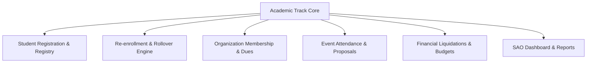
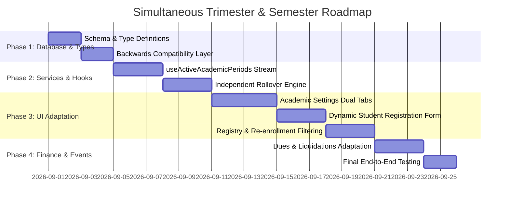

# Architectural Strategy: Supporting Trimesters (Senior High School) & Semesters (College) Simultaneously

> **Status:** Open Discussion & Design Document  
> **Target System:** STI Sync Web & Mobile Platform  
> **Prepared For:** SAO Administration & Development Pair  
> **Purpose:** Architectural analysis and roadmap for introducing a simultaneous Dual-Track Academic Period Model (College Semesters vs. SHS Trimesters).

---

## 1. Executive Summary & Problem Definition

### Current Architecture
The current STI Sync architecture assumes a **single, global active semester** across the entire campus:
- `SemesterTerm = '1st Semester' | '2nd Semester'`
- `StudentYearLevel = '1st Year' | '2nd Year' | '3rd Year' | '4th Year'`
- `activeSemester = semesters.find(s => s.status === 'ACTIVE')`

### The Real-World Challenge
In STI campuses:
1. **College / Tertiary Education** operates on a **2-Semester** cycle (1st Semester, 2nd Semester, optional Midyear/Summer).
2. **Senior High School (SHS)** operates on a **3-Trimester** cycle (1st Trimester, 2nd Trimester, 3rd Trimester).
3. **Year Levels Differ**:
   - College: `1st Year`, `2nd Year`, `3rd Year`, `4th Year`
   - SHS: `Grade 11`, `Grade 12`
4. **Simultaneous Asynchronous Schedules**:
   - When College is in the middle of **2nd Semester** (Jan – May), SHS may be transitioning from **2nd Trimester** (Nov – Feb) to **3rd Trimester** (Mar – June).
   - Re-enrollment, membership dues, event eligibility, and archival cycles run on **different timelines**.

---

## 2. Comprehensive Impact & Dependency Audit

Every module in STI Sync that touches academic periods must be audited:



### Module-by-Module Audit Table

| Module | Current State | Dual-Track Impact | Required Changes |
| :--- | :--- | :--- | :--- |
| **Academic Periods (`academic.types.ts`)** | Only `1st Semester`, `2nd Semester`. Single `ACTIVE` doc. | SHS has `1st Trimester`, `2nd Trimester`, `3rd Trimester`. Two periods must be active concurrently. | Add `academicLevel: 'COLLEGE' \| 'SHS'` and `termType: 'SEMESTER' \| 'TRIMESTER'`. Allow 1 active per level. |
| **Student Types (`student.types.ts`)** | `StudentSemester = '1st Sem' \| '2nd Sem'`. `yearLevel = '1st Year' ... '4th Year'`. | SHS students cannot select 3rd Trimester or Grade 11/12. | Extend `StudentTerm` union, add `academicLevel`, add SHS Grade levels. |
| **Student Registration (Self & Admin)** | Fixed semester dropdown and 4 college year levels. | SHS registrants cannot pick their strand, grade level, or trimester. | Dynamic form dependent on selected Department/Track (College vs. SHS). |
| **Student Registry & Re-enrollment** | Checks `student.semester !== activeSemester.semester`. | Flagged false positives for SHS students if compared against College active semester. | Evaluate re-enrollment against the student's respective academic level active period. |
| **Organization Dues (`payable.service.ts`)** | Dues generated per `activeSemester.id`. | SHS club members need dues per trimester (3x/year), College per semester (2x/year). | Tag payables with `academicLevel` and respective `termId`. |
| **Event Proposals & Attendance** | Session date restriction by single active semester. | Events can target SHS only, College only, or All. | Event wizard level filter (`targetAcademicLevels: ['COLLEGE', 'SHS']`). |
| **Dashboard Greeting Banner** | Displays single `activeSemester.label`. | Needs to reflect both active College Semester & SHS Trimester. | Show dual active badges (e.g., `College: 2nd Sem` \| `SHS: 3rd Tri`). |
| **Semester Rollover Engine** | Rolls over all students at once. | College & SHS cannot be rolled over on the same date. | Track-specific Rollover: Rollover College OR Rollover SHS independently. |

### Detailed Impact on Key Modules

#### 1. Semester Rollover Engine
- **Current Behavior**: The rollover process is global. Calling `executeSemesterRollover()` updates the status of the current active semester to `COMPLETED`, marks the next semester as `ACTIVE`, and rolls over year levels for all students.
- **Dual-Track Impact**: College semesters and SHS trimesters rollover on entirely different dates. Doing a global rollover will prematurely advance SHS students while College is still in session, or vice-versa.
- **Required Changes**:
  - Refactor `executeSemesterRollover(academicLevel: 'COLLEGE' | 'SHS')` to target only the specified level.
  - Filter students to be rolled over based on their `academicLevel`.
  - Ensure track-specific logs and history records are created independently.

#### 2. Student Registry & Registration
- **Current Behavior**: Handles registration and queries using global `activeSemester` assumptions. Flags students as "Pending Re-enrollment" if their term does not match the single active semester.
- **Dual-Track Impact**: SHS students will be incorrectly flagged as pending re-enrollment during periods when College starts a new semester but SHS is still in the middle of a trimester.
- **Required Changes**:
  - Update `useActiveAcademicPeriods` hook to provide level-specific indicators.
  - Refactor checking logic in `StudentRegistry.tsx` to compare College students against `activeCollegePeriod` and SHS students against `activeShsPeriod`.
  - Update the student registration form (both self-registration and admin manual creation) to dynamically filter year levels (`Grade 11/12` vs `1st-4th Year`) and term options based on the chosen department's `academicLevel`.

#### 3. Events & Attendance Proposals
- **Current Behavior**: Events are linked to `activeSemester.id` for budgeting, proposals, and scheduling.
- **Dual-Track Impact**: Events might target SHS-only, College-only, or both tracks. The calendar and event filters need to know which academic periods are applicable.
- **Required Changes**:
  - Add `targetAcademicLevels: ('COLLEGE' | 'SHS')[]` to the event schema.
  - Update `Step2Schedule.tsx` in the event proposal wizard to allow selecting the correct active period based on the target academic level.
  - Ensure event listings and search filters can filter by academic track.

#### 4. Financial Liquidations & Budgeting
- **Current Behavior**: The budget, fund settings, and ledger transactions are grouped and filtered by a single `semesterId` (`activeSemester.id`).
- **Dual-Track Impact**: Since the ledger has dual active terms, financial reports, budget allocations, and collections need to distinguish between College funds and SHS funds.
- **Required Changes**:
  - Update ledger transactions to include `academicLevel` and the corresponding `termId`.
  - Group and display running balances in `FinanceCenter.tsx` separately or introduce filter tabs for `College` and `SHS` transactions.
  - In `GenerateDuesModal.tsx` and `AddPayableModal.tsx`, allow selecting whether the due is for College, SHS, or both, automatically assigning them the correct active term IDs.

---

## 3. Proposed Core Solution: Dual-Track Academic Architecture

### A. Academic Level & Track Schema Enhancement

We introduce the concept of `AcademicLevel` (`COLLEGE` vs `SHS`):

```typescript
// src/app/modules/academic/types/academic.types.ts

export type AcademicLevel = 'COLLEGE' | 'SHS';

export type SemesterTerm = '1st Semester' | '2nd Semester' | 'Summer';
export type TrimesterTerm = '1st Trimester' | '2nd Trimester' | '3rd Trimester';

export type AcademicTerm = SemesterTerm | TrimesterTerm;
export type AcademicPeriodStatus = 'ACTIVE' | 'UPCOMING' | 'COMPLETED';

export interface AcademicPeriodDocument {
  id: string;
  academicYear: string;           // e.g. "2026-2027"
  academicLevel: AcademicLevel;   // 'COLLEGE' | 'SHS'
  termType: 'SEMESTER' | 'TRIMESTER';
  term: AcademicTerm;             // '1st Semester' | '1st Trimester', etc.
  label: string;                  // e.g. "COL-AY2026-2027-1S" or "SHS-AY2026-2027-2T"
  startDate: string;              // YYYY-MM-DD
  endDate: string;                // YYYY-MM-DD
  reenrollDeadline: string;       // YYYY-MM-DD
  status: AcademicPeriodStatus;
  eventsCount: number;
  studentsCount: number;
  archived: boolean;
  createdAt: Timestamp;
  updatedAt: Timestamp;
}
```

### B. Department & Course Mapping

Departments define their `academicLevel`. Courses and sections inherit this automatically:

```typescript
export interface DepartmentDocument {
  id: string;
  name: string;                   // e.g. "Senior High School Department" vs "Information Technology Department"
  code: string;                   // e.g. "SHS", "DIT", "DBA"
  academicLevel: AcademicLevel;   // 'COLLEGE' | 'SHS'
  archived: boolean;
  createdAt: Timestamp;
  updatedAt: Timestamp;
}

export interface CourseDocument {
  id: string;
  name: string;                   // e.g. "STEM", "TVL-ICT", "BS Information Technology"
  code: string;                   // e.g. "STEM", "BSIT"
  departmentId: string;
  academicLevel: AcademicLevel;   // Inherited from department
  yearLevels: number;             // 2 for SHS (Grades 11-12), 4 for College
  archived: boolean;
}
```

### C. Enhanced Student Document Schema

```typescript
// src/app/modules/students/types/student.types.ts

export type StudentYearLevel = 
  | 'Grade 11' | 'Grade 12'                       // SHS
  | '1st Year' | '2nd Year' | '3rd Year' | '4th Year'; // College

export type StudentTerm = 
  | '1st Semester' | '2nd Semester' | 'Summer'     // College
  | '1st Trimester' | '2nd Trimester' | '3rd Trimester'; // SHS

export interface StudentDocument {
  id: string;
  // ... Identity fields ...
  
  // Academic Track Linkage
  academicLevel: AcademicLevel;   // 'COLLEGE' | 'SHS'
  departmentId: string;
  departmentName: string;
  courseId: string;               // Strand (for SHS) or Degree Program (for College)
  courseCode: string;             // e.g. "STEM" or "BSIT"
  yearLevel: StudentYearLevel;     // "Grade 11" or "3rd Year"
  section: string;                // e.g. "ICT 11-A" or "BSIT 301"
  
  schoolYear: string;             // "2026-2027"
  term: StudentTerm;              // "2nd Trimester" or "1st Semester"
  semester?: StudentTerm;         // (Kept for backwards compatibility)
  
  // ... Status, Auth, Timestamps ...
}
```

---

## 4. How Simultaneous Active Periods Work

Instead of looking for a single active semester:
```typescript
// OLD (Single Point of Failure):
const activeSemester = semesters.find(s => s.status === 'ACTIVE');
```

We introduce a reactive hook: **`useActiveAcademicPeriods()`**:

```typescript
// src/app/modules/academic/hooks/useAcademicStream.ts

export function useActiveAcademicPeriods() {
  const { data: periods = [], loading, error } = useAcademicPeriodsStream();

  const activeCollegePeriod = useMemo(() => {
    return periods.find(p => !p.archived && p.academicLevel === 'COLLEGE' && p.status === 'ACTIVE');
  }, [periods]);

  const activeShsPeriod = useMemo(() => {
    return periods.find(p => !p.archived && p.academicLevel === 'SHS' && p.status === 'ACTIVE');
  }, [periods]);

  /** Helper to get active period matching a specific student or department */
  const getActivePeriodFor = useCallback((level: AcademicLevel) => {
    return level === 'SHS' ? activeShsPeriod : activeCollegePeriod;
  }, [activeShsPeriod, activeCollegePeriod]);

  /** Helper to evaluate if a student needs re-enrollment */
  const isStudentPendingReEnrollment = useCallback((student: StudentDocument) => {
    const activePeriod = getActivePeriodFor(student.academicLevel || 'COLLEGE');
    if (!activePeriod) return false;
    
    return (
      student.schoolYear !== activePeriod.academicYear ||
      (student.term || student.semester) !== activePeriod.term
    );
  }, [getActivePeriodFor]);

  return {
    activeCollegePeriod,
    activeShsPeriod,
    getActivePeriodFor,
    isStudentPendingReEnrollment,
    loading,
    error,
  };
}
```

---

## 5. UI / UX Design & Workflow Changes

### 1. SAO Academic Period Settings Page
Divide the Academic Period Settings into **two tabs**:
- **College Tab (Semestral)**: Manage 1st Sem, 2nd Sem, Midyear. Set Active College Term.
- **Senior High School Tab (Trimestral)**: Manage 1st Tri, 2nd Tri, 3rd Tri. Set Active SHS Term.

```
[ Academic Year & Term Settings ]
-------------------------------------------------------------------------
[ College (Semesters) ]   [ Senior High School (Trimesters) ]
-------------------------------------------------------------------------
Active Term: A.Y. 2026-2027 · 2nd Semester       [ Rollover College ]
Status: 🟢 ACTIVE  |  Ends: May 31, 2027 (12 weeks left)
-------------------------------------------------------------------------
+ Add College Semester | Export Term Roster
- 1st Semester (Aug 2026 - Dec 2026) -> Completed
- 2nd Semester (Jan 2027 - May 2027) -> ACTIVE
```

### 2. Student Self-Registration & Manual Creation Form
When a student picks their Department / Course:
- If **Senior High School** is selected:
  - Year Level dropdown dynamically shows: `Grade 11`, `Grade 12`.
  - Term dropdown dynamically shows: `1st Trimester`, `2nd Trimester`, `3rd Trimester` (defaulting to current active SHS trimester).
- If **College Department** is selected:
  - Year Level dropdown shows: `1st Year`, `2nd Year`, `3rd Year`, `4th Year`.
  - Term dropdown shows: `1st Semester`, `2nd Semester` (defaulting to current active College semester).

### 3. Re-enrollment Management
In `ReEnrollmentManagement.tsx`:
- Filter buttons at the top: `All Tracks` | `College Only` | `SHS Only`.
- Re-enrollment batch action can be executed independently per track.

### 4. Financial Dues & Payables
In `GenerateDuesModal.tsx` & `AddPayableModal.tsx`:
- Scope selector:
  - `Campus-Wide`: Generates dues for both College & SHS.
  - `College Only`: Links to active College semester.
  - `SHS Only`: Links to active SHS trimester.

---

## 6. Implementation Roadmap (Phased Execution)



### Phase 1: Types & Schema Foundation
1. Update `academic.types.ts` to include `AcademicLevel`, `TrimesterTerm`, `AcademicPeriodDocument`.
2. Update `student.types.ts` to include `AcademicLevel`, `StudentYearLevel` (Grades 11-12), and `StudentTerm`.
3. Add migration fallback so existing student documents without `academicLevel` default to `'COLLEGE'`.

### Phase 2: Stream & Service Layer
1. Refactor `academic.service.ts` to support querying by `academicLevel`.
2. Implement `useActiveAcademicPeriods()` with dual active period resolution.
3. Update `executeSemesterRollover()` to accept `academicLevel` so College and SHS can rollover independently.

### Phase 3: Admin UI & Student Registry
1. Update `AcademicSemesterSettings.tsx` to include `College` vs `Senior High School` tabs.
2. Update `AddStudentManuallyModal.tsx` and self-registration to dynamically render grade levels and terms based on department track.
3. Update `ReEnrollmentManagement.tsx` to use level-aware re-enrollment checks.

### Phase 4: Finance, Events, & Reporting
1. Update Organization membership dues generation to target specific terms (Trimester vs Semester).
2. Update Dashboard welcome banner to display both active terms.
3. Update Reports export utility to support filtering by academic level.

---

## 7. Immediate Next Steps & Decision Points

1. **Adviser / Campus Policy Confirmation**:
   - Confirm official naming for SHS terms (e.g. *1st Trimester*, *2nd Trimester*, *3rd Trimester* vs *Term 1*, *Term 2*, *Term 3*).
   - Confirm if SHS student numbers share the same student ID format as College.
2. **Review this Plan**:
   - Keep this document (`docs/academic-dual-term-trimester-plan.md`) as the primary architectural specification for implementation when scheduled.
